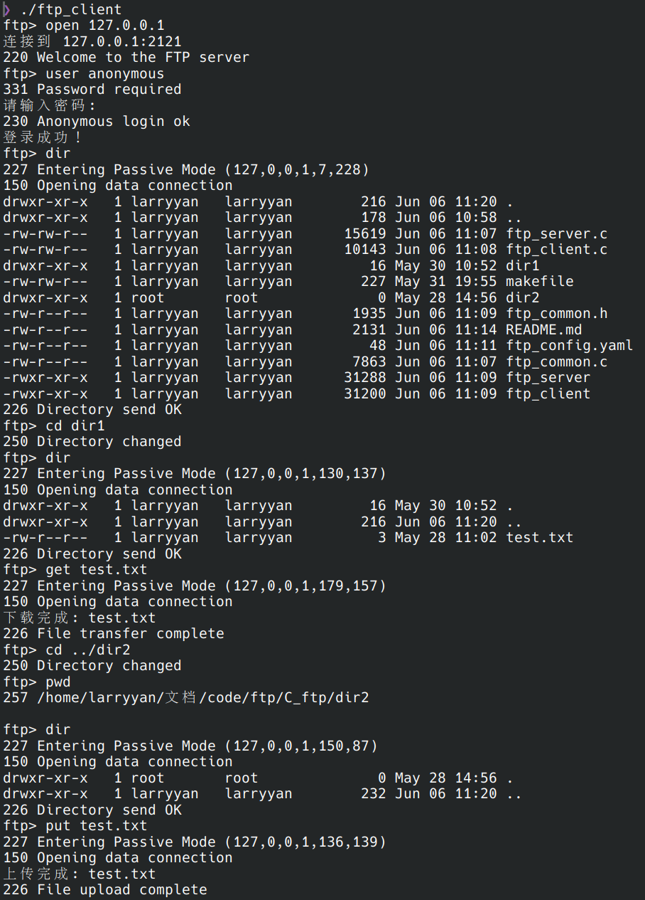
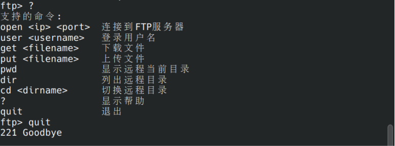
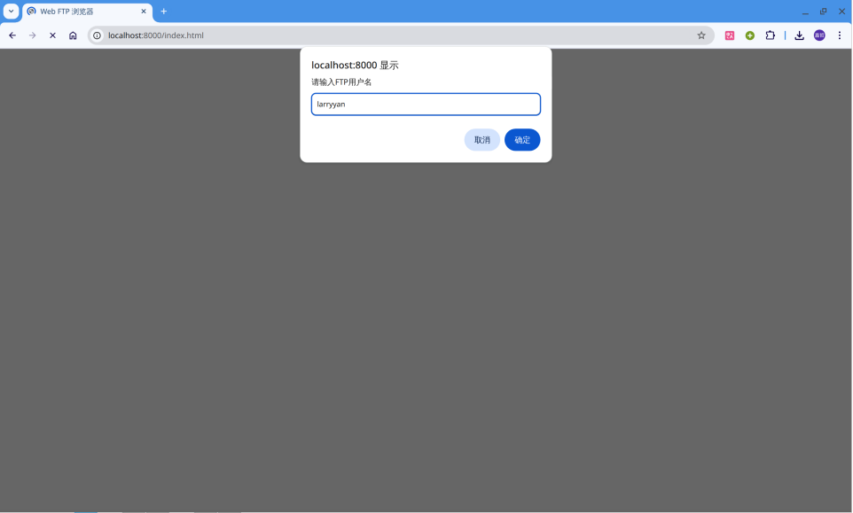
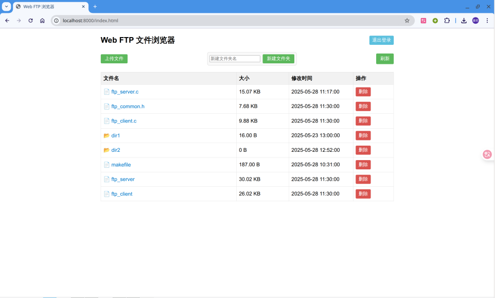
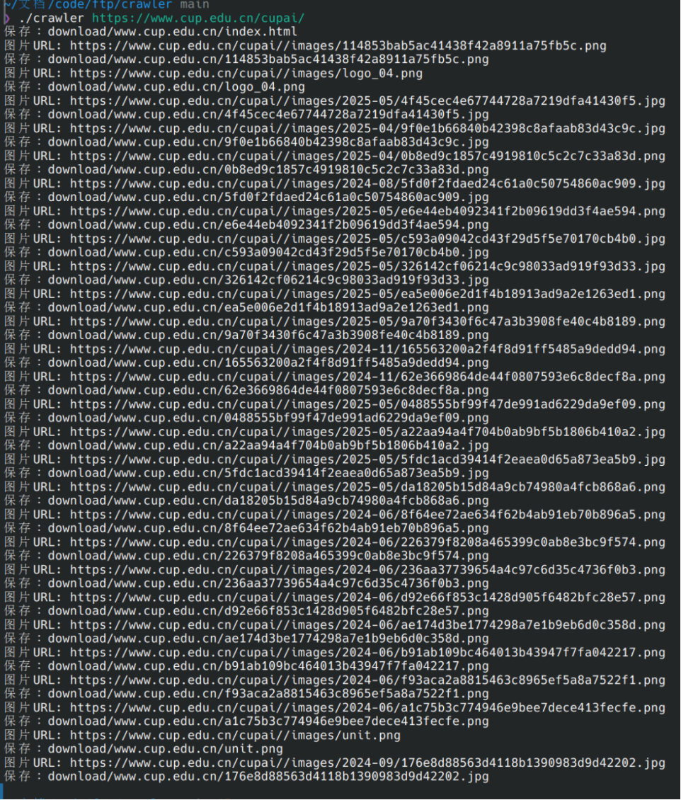
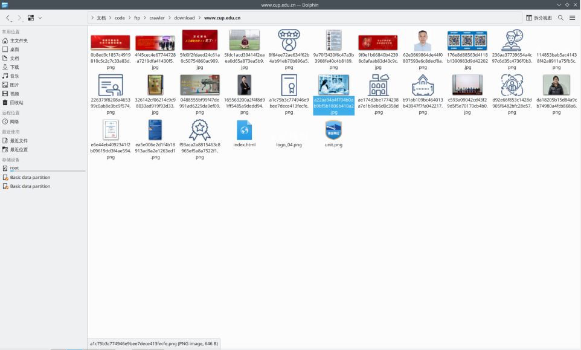

# FTP-Homework


- This is an assignment for a computer network internship course.

- This project consists of the following parts:
  - FTP server implemented in C language ([details here](C_ftp/README.md))
  - FTP client implemented in C language ([details here](C_ftp/README.md))
  - A web-based FTP file browser implemented in Python ([details here](ftp_web/README.md))
  - A socket-based web crawler in C language ([details here](crawler/README.md))
  
- All FTP client/server and crawler should be run on a Linux operating system.

## Preparation

### Compile C server, client and the crawler

```bash
make
```

### Install required Python packages

#### Ubuntu / Debian

```bash
sudo apt install python-requests
sudo apt install python-cgi
```

#### Arch Linux

```bash
sudo pacman -S python-requests
sudo pacman -S python-cgi
```

## Run

### FTP Server

```bash
cd C_ftp
sudo ./ftp_server
```

### FTP Client

```bash
cd C_ftp
./ftp_client
```





### Web based FTP browser

```bash
python3 ftp_web/ftp_client_web.py
```



- login by your account and password



### Socket based web crawler

```bash
cd crawler
./crawler_https https://example.com
```





- The website and images have been downloaded to the download/"domain" folder.

---

## More Details

- [C FTP server/client details](C_ftp/README.md)
- [Web-based FTP browser details](ftp_web/README.md)
- [Socket-based web crawler details](crawler/README.md)

---

[License (MIT)](LICENSE)